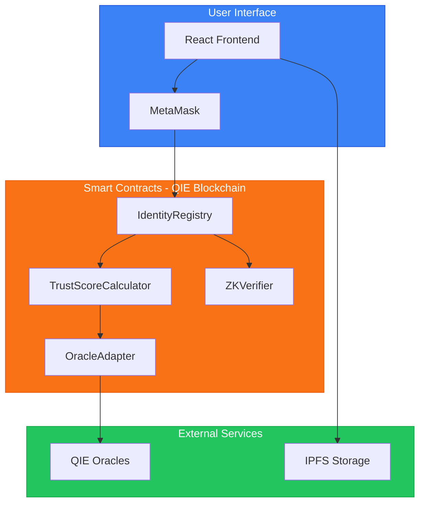
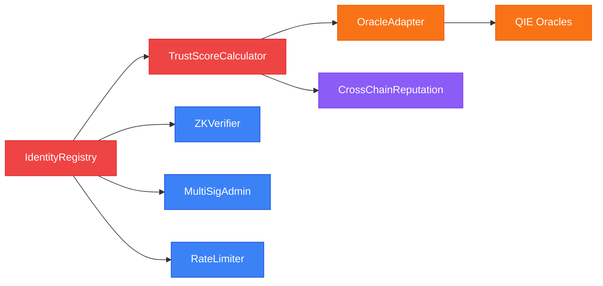
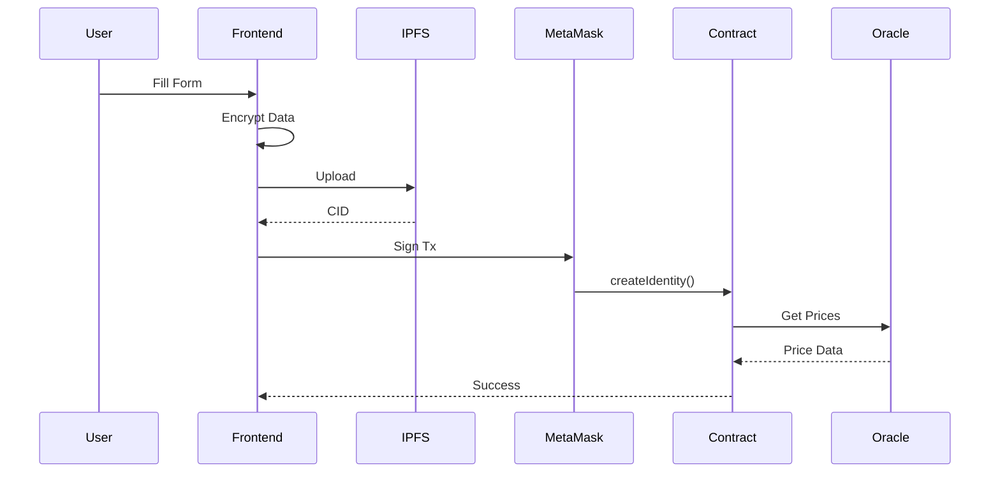
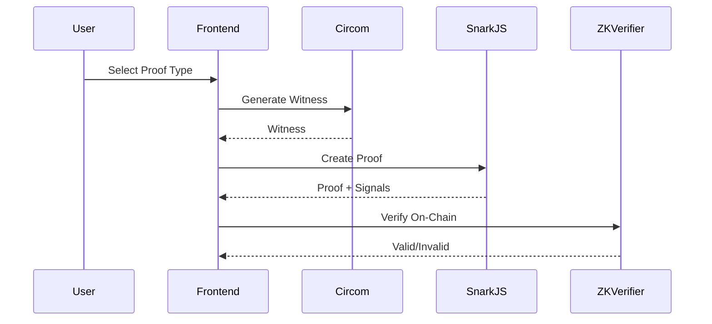
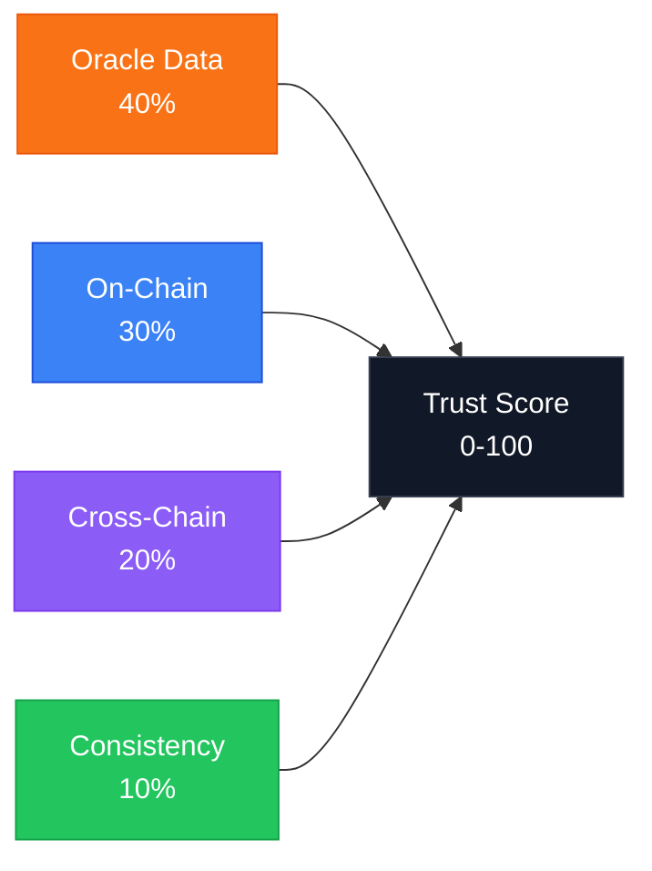
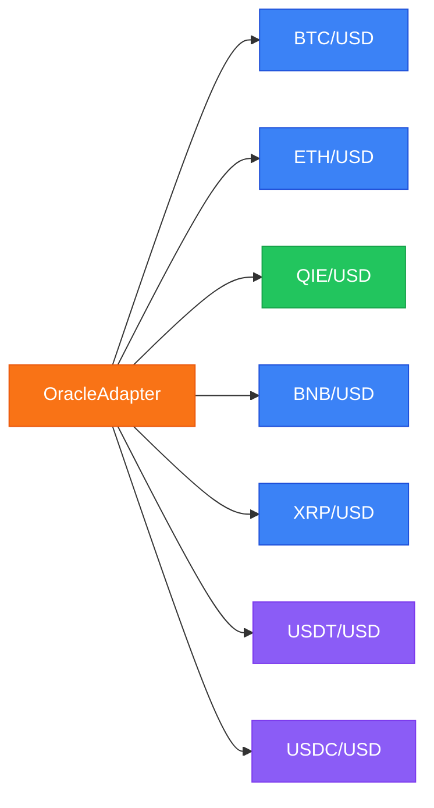
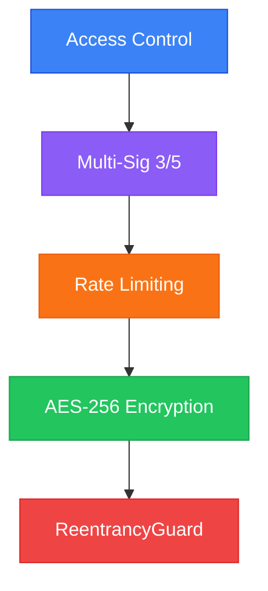
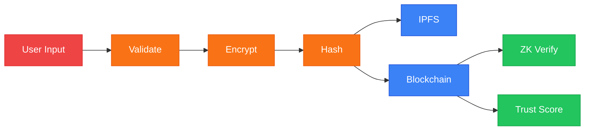
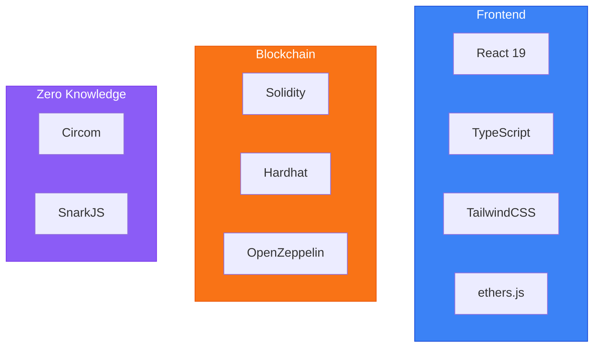
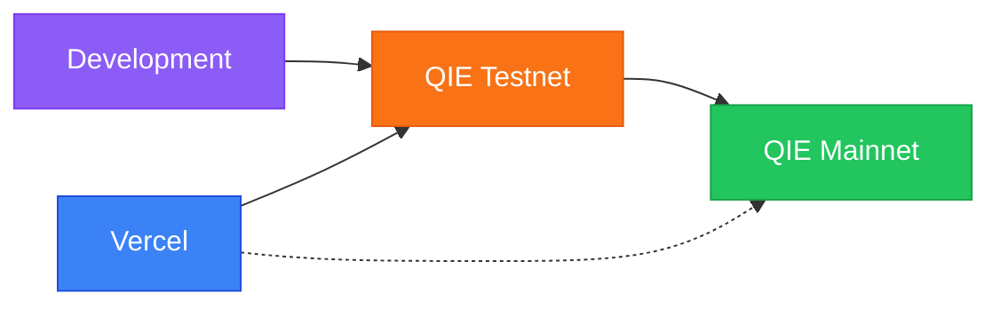

# VeriChain Architecture Documentation

> Technical diagrams for QIE Blockchain Hackathon 2025

---

## 1. System Architecture

---

## 2. Smart Contract Layer

---

## 3. Identity Creation Flow

---

## 4. ZK Proof Flow

---

## 5. Trust Score Calculation

---

## 6. Oracle Integration

---

## 7. Security Layers

---

## 8. Data Flow

---

## 9. Tech Stack

---

## 10. Deployment

---

## Contract Addresses

| Contract | Address |
|----------|---------|
| IdentityRegistry | `0x33b9...C6` |
| OracleAdapter | `0x3237...5B` |
| TrustScoreCalculator | `0xEb0a...8A` |
| ZKVerifier | `0x056c...4C` |
| MultiSigAdmin | `0x6668...6C` |
| RateLimiter | `0xA9b1...c8` |
| CrossChainReputation | `0xF7fD...89` |

---

## Network Config

| Network | Chain ID | RPC |
|---------|----------|-----|
| Testnet | 1983 | rpc1testnet.qie.digital |
| Mainnet | 5765 | rpc.qie.digital |

---

**VeriChain Identity Protocol** | QIE Hackathon 2025 | Yashodip More & Komal Kumavat
