# VeriChain Architecture Documentation

> Complete system architecture, workflows, and technical diagrams for QIE Blockchain Hackathon 2025

---

## 1. High-Level System Architecture

```mermaid
flowchart TB
    subgraph USER["👤 User Layer"]
        A[Web Browser] --> B[React 19 Frontend]
        B --> C[MetaMask Wallet]
    end

    subgraph FRONTEND["🖥️ Frontend Application"]
        D[Landing Page] --> E[Dashboard]
        E --> F[Create Identity]
        E --> G[Verify Identity]
        E --> H[ZK Proof Generator]
        E --> I[Credentials Manager]
    end

    subgraph BLOCKCHAIN["⛓️ QIE Blockchain Layer"]
        J[IdentityRegistry] --> K[TrustScoreCalculator]
        K --> L[OracleAdapter]
        L --> M[QIE Oracle Network]
        J --> N[ZKVerifier]
        J --> O[MultiSigAdmin]
        J --> P[RateLimiter]
        J --> Q[CrossChainReputation]
    end

    subgraph STORAGE["💾 Decentralized Storage"]
        R[IPFS via Pinata]
        S[AES-256 Encrypted Data]
    end

    B --> J
    C --> J
    F --> R
    R --> S

    style USER fill:#f0f9ff,stroke:#0ea5e9
    style FRONTEND fill:#fef3c7,stroke:#f59e0b
    style BLOCKCHAIN fill:#fce7f3,stroke:#ec4899
    style STORAGE fill:#ecfdf5,stroke:#10b981
```

---

## 2. Smart Contract Architecture

---

## 3. Identity Creation Workflow

```mermaid
sequenceDiagram
    autonumber
    participant U as 👤 User
    participant F as 🖥️ Frontend
    participant M as 🦊 MetaMask
    participant I as 📦 IPFS
    participant B as ⛓️ IdentityRegistry
    participant T as 📊 TrustScoreCalculator
    participant O as 🔮 OracleAdapter

    U->>F: Fill Identity Form
    F->>F: Validate Input (Zod)
    F->>F: Encrypt Data (AES-256)
    F->>I: Upload Encrypted JSON
    I-->>F: Return IPFS CID
    F->>M: Request Signature
    M-->>U: Confirm Transaction
    U->>M: Approve
    M->>B: createIdentity(did, ipfsHash, credentials)
    B->>T: calculateInitialScore(user)
    T->>O: getAssetPrices()
    O-->>T: Return 7 Price Feeds
    T-->>B: Return Trust Score
    B-->>F: Identity Created Event
    F-->>U: Show Success + DID
```

---

## 4. Zero-Knowledge Proof Workflow

```mermaid
sequenceDiagram
    autonumber
    participant U as 👤 User
    participant F as 🖥️ Frontend
    participant C as 🔐 Circom Circuit
    participant S as 📜 SnarkJS
    participant V as ✅ ZKVerifier Contract

    U->>F: Select Proof Type (Age/Degree/etc)
    F->>F: Load Private Inputs
    F->>C: Generate Witness
    C-->>F: Witness Generated
    F->>S: Generate Proof (Groth16)
    S-->>F: {proof, publicSignals}
    F->>V: verifyProof(proof, publicSignals)
    V->>V: Pairing Check
    V-->>F: Return true/false
    F-->>U: Proof Verified ✅
```

---

## 5. Trust Score Calculation Flow

```mermaid
flowchart TD
    A[User Address] --> B{Fetch Data}
    
    B --> C[Oracle Data<br/>40% Weight]
    B --> D[On-Chain Activity<br/>30% Weight]
    B --> E[Cross-Chain Rep<br/>20% Weight]
    B --> F[Time Consistency<br/>10% Weight]
    
    C --> G[BTC Price]
    C --> H[ETH Price]
    C --> I[QIE Price]
    C --> J[+ 4 More Feeds]
    
    G --> K[Financial Score]
    H --> K
    I --> K
    J --> K
    
    D --> L[Transaction Count]
    D --> M[Account Age]
    D --> N[Verification History]
    
    L --> O[Activity Score]
    M --> O
    N --> O
    
    E --> P[Multi-Chain Analysis]
    P --> Q[Reputation Score]
    
    F --> R[Behavioral Analysis]
    R --> S[Consistency Score]
    
    K --> T[Final Trust Score<br/>0-100]
    O --> T
    Q --> T
    S --> T
    
    T --> U{Score Range}
    U -->|0-30| V[🔴 Low Trust]
    U -->|31-60| W[🟡 Medium Trust]
    U -->|61-85| X[🟢 High Trust]
    U -->|86-100| Y[⭐ Elite Trust]

    style T fill:#f59e0b,stroke:#d97706,color:#fff
    style V fill:#ef4444,stroke:#dc2626
    style W fill:#eab308,stroke:#ca8a04
    style X fill:#22c55e,stroke:#16a34a
    style Y fill:#8b5cf6,stroke:#7c3aed
```

---

## 6. QIE Oracle Integration

---

## 7. Security Architecture

---

## 8. Data Flow Architecture

---

## 9. Technology Stack Diagram

---

## 10. Proof-of-Real-World-Stake Concept

---

## 11. Deployment Architecture

---

## 12. User Journey Map

---

## Contract Addresses (QIE Testnet)

| Contract | Address | Purpose |
|----------|---------|---------|
| IdentityRegistry | `0x33b9eb7320c2ACE82caDBA8F61eAB5D72E8282C6` | Core DID storage |
| OracleAdapter | `0x32376c7aABa1c6F9d802Ede04d7e106d113e275B` | QIE Oracle integration |
| TrustScoreCalculator | `0xEb0a50DEAb93c92730E1429Fb2A82B431C54b48A` | Dynamic scoring |
| ZKVerifier | `0x056cbf01E11105858005E6aB43076a41387D164C` | ZK proof verification |
| MultiSigAdmin | `0x6668fF8D75209B51D2D292ceF5A688F77142cb6C` | Governance |
| RateLimiter | `0xA9b1Ff4B906F11629fAcB9183cd8b201A8f452c8` | Anti-spam |
| CrossChainReputation | `0xF7fD38Bf7EFDFA33b7fa368b9A87d76c92f38389` | Multi-chain rep |

---

**VeriChain Identity Protocol**

*QIE Blockchain Hackathon 2025*

Built by **Yashodip More** & **Komal Kumavat**

